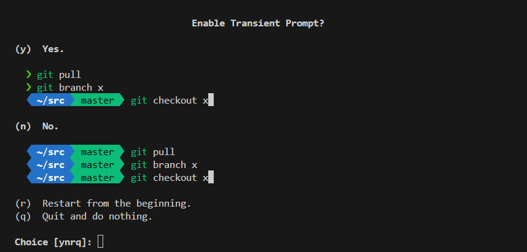

### Initialize

```
$ sh -c "$(curl -fsSL https://raw.githubusercontent.com/hoban4336/ubuntu/main/init.sh)"
```

##### Terminal Setting
```
$ p10k configure
```

[y]
[n]
[n]
[3]
[1]
[2]
[2]
[1]
[3]
[3]
[1]
[1]
[1]
[n]
[1]


### Mount
```
/dev/nvme0n1p3  233G   13G  209G    6% /
/dev/sda2        91G   28K   86G    1% /mnt/storage
/dev/sda3        92G   24K   87G    1% /mnt/minio
```